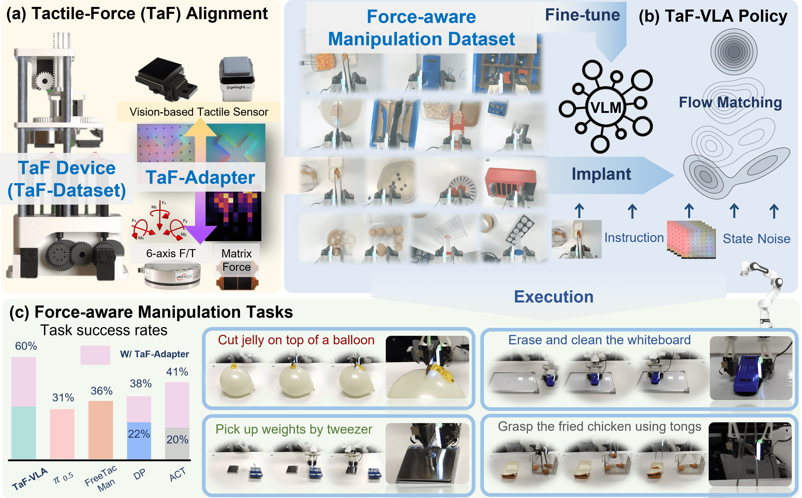

# TaF-VLA: Tactile-Force Alignment in Vision-Language-Action Models for Force-aware Manipulation

  

## 🦾 Highlight

- **Tactile-Force Data Acquisition Device**: We develop a low-cost, automated device and pipeline for collecting aligned tactile-force data at scale.
- **Tactile-Force Alignment**: We introduce the TaF-Adapter, a module that maps sequential tactile observations into a force-aligned latent space using a contrastive learning framework. By constructing a vector-quantized shared latent space that aligns temporal visuotactile data with 6-axis force/torque signals and matrix pressure maps, our approach learns representations that are robust to force noise and cross-sensor variation, while capturing rich, history-dependent contact dynamics.
- **TaF-VLA Policy**: We developed the TaF-VLA model, a VLA framework capable of incorporating tactile information. Experiments show that explicit force alignment enables VLA policies to successfully perform force-sensitive manipulation tasks that are otherwise intractable for vision-only or naive tactile-vision aligned baselines.

## 🎯 Experiment results

<video id="demo_video" src="demo_compressed.mp4" controls="controls" width="100%"></video>
