

# TaF-VLA: Tactile-Force Alignment in Vision-Language-Action Models   for Force-aware Manipulation

 

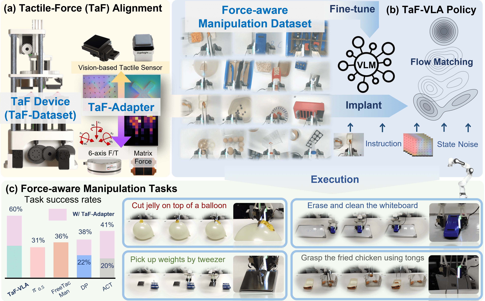

---

## 🌟 Highlights

**TaF-VLA** enables robots to "feel" what they touch by aligning tactile and force data within a Vision-Language-Action framework.

- **🤖 Tactile-Force Data Acquisition Device**  
  We develop a low-cost, automated device and pipeline for collecting aligned tactile-force data at scale.

- **🧠 Tactile-Force Alignment (TaF-Adapter)**  
  We introduce the **TaF-Adapter**, a module that maps sequential tactile observations into a force-aligned latent space via contrastive learning. By constructing a vector-quantized shared latent space, our approach aligns temporal visuotactile data with 6-axis force/torque signals. This results in representations robust to force noise and cross-sensor variation while capturing rich, history-dependent contact dynamics.

- **🦾 TaF-VLA Policy**  
  We propose **TaF-VLA**, a framework capable of incorporating tactile information into VLA models. Experiments show that explicit force alignment enables force-aware manipulation behaviors difficult for vision-only or naive tactile-vision baselines.

---

## 🛠️ Hardware Design

### Mechanical Structure & Assembly

| Mechanical Structure | Assembly Process |
| :---: | :---: |
| 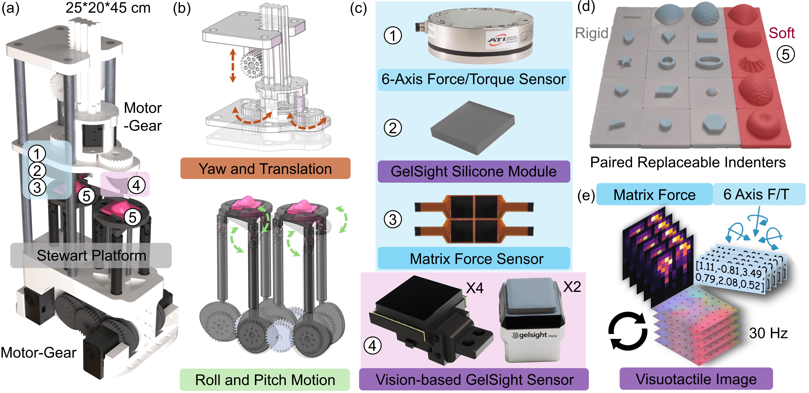 | 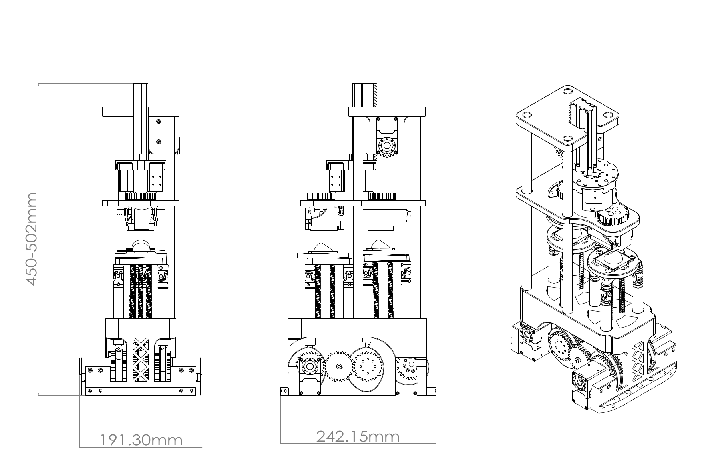 |

**Description:**  
We design a compact, low-cost device (**TaF-Device**) enabling rapid acquisition of large-scale tactile-force aligned data pairs.

 

### Hardware Demonstration

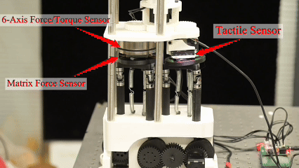

**Description:**  
The TaF-Device in operation during data collection, showcasing synchronized tactile and force signal acquisition.

---

## 📂 Force-aware Manipulation Dataset

  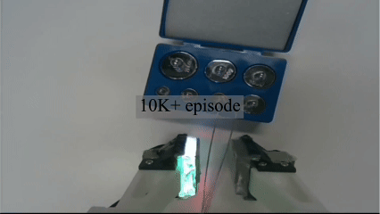

We introduce a comprehensive **force-aware manipulation dataset** covering diverse objects and interaction scenarios, featuring synchronized vision, tactile, and force observations.

---

## 📊 Experiment Results

### 1. Robust Manipulation (TaF-VLA Highlight)

| Jelly Slicing (Deformable) | Weight Lifting (Rigid) |
| :---: | :---: |
| 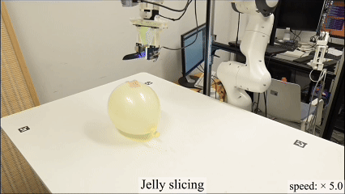 | 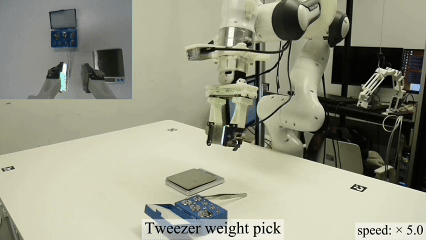 |

**Result:** TaF-VLA demonstrates robust manipulation performance across objects with significantly different physical properties.

 

### 2. Comparison with Baselines

#### Tweezer Weight Pick
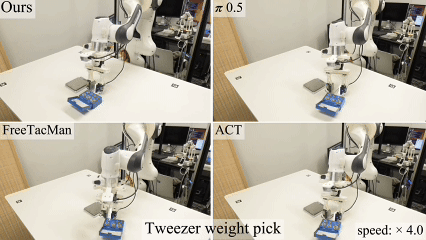
<em>Comparison of different methods on weighted object grasping tasks.</em>

 

#### Jelly Slicing
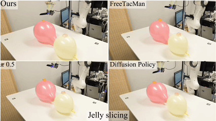
<em>TaF-VLA maintains stable contact and force control when manipulating soft objects.</em>

 

#### Tube Insertion
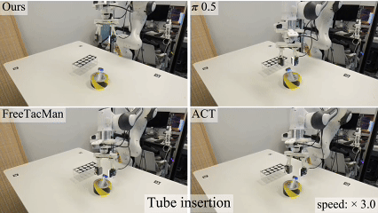
<em>Our method achieves higher success rates and smoother force profiles than baseline approaches.</em>

 

### 3. Plug-and-Play Capability

  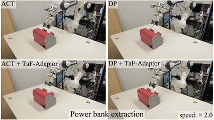

**Insight:** The proposed **TaF-Adapter** supports plug-and-play integration with various policy backbones (e.g., Diffusion Policy, ACT) without architecture-specific tuning.

 

### 4. Alignment vs. Prediction

  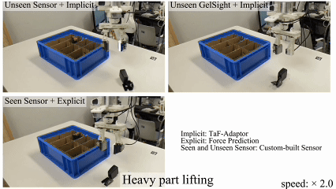

**Insight:** Instead of explicitly predicting forces, TaF-Adapter aligns multimodal representations in a shared semantic latent space, leading to superior robustness and cross-sensor generalization.

 

### 5. Ablation Study

| Component Analysis A | Component Analysis B |
| :---: | :---: |
| 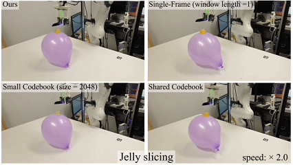 | 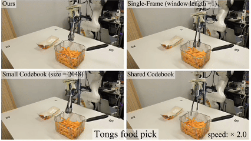 |

**Conclusion:** Ablation results confirm that each component of the TaF-Adapter is critical for achieving robust force-aware manipulation.
