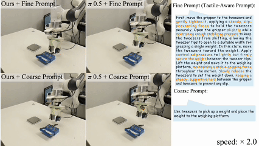

# TaF-VLA: Tactile-Force Alignment in Vision-Language-Action Models for Force-aware Manipulation

  

## 🦾 Highlight

- **Tactile-Force Data Acquisition Device**: We develop a low-cost, automated device and pipeline for collecting aligned tactile-force data at scale.
- **Tactile-Force Alignment**: We introduce the TaF-Adapter, a module that maps sequential tactile observations into a force-aligned latent space using a contrastive learning framework. By constructing a vector-quantized shared latent space that aligns temporal visuotactile data with 6-axis force/torque signals and matrix pressure maps, our approach learns representations that are robust to force noise and cross-sensor variation, while capturing rich, history-dependent contact dynamics.
- **TaF-VLA Policy**: We developed the TaF-VLA model, a VLA framework capable of incorporating tactile information. Experiments show that explicit force alignment enables VLA policies to successfully perform force-sensitive manipulation tasks that are otherwise intractable for vision-only or naive tactile-vision aligned baselines.

## 📌 Hardware Design

### 🔧 Mechanical Structure & Assembly

  
  

**Description:**  
We have designed a device capable of rapidly acquiring large quantities of tactile-force aligned data pairs.(TaF-Device)

 

### 🎥 Hardware Demonstration

**Description:**  
The video demonstrates the TaF-Device in operation.

---

## 📦 Force-aware Manipulation Dataset

**Description:**  
We introduce a force-aware manipulation dataset consisting of diverse objects and interaction scenarios.

---

## 🎯 Experiment Results

### 1️⃣ TaF-VLA Highlight

  
  

**Description:**  
TaF-VLA demonstrates robust manipulation performance across objects with significantly different physical properties, including deformable and rigid objects.

---

### 2️⃣ Comparison with Baselines

**Weight Object Comparison:**  
Different models performance in task-"Tweezer Weight Pick".

 

**Deformable Object Comparison:**  
Different models performance in task-"Jelly Slicing".

 

**Tubular Object Comparison:**  
Different models performance in task-"Tube Insertion".

---

### 3️⃣ Plug-and-Play Capability

**Description:**  
The proposed TaF-Adaprter supports plug-and-play deployment across different mdoel(including Diffusion Policy and Act).

---

### 4️⃣ Comparison with Force Prediction

**Description:**  
TaF-Adapter aligns representations in a semantic latent space. This contrastive alignment encourages the model to learn force-relevant features that are invariant to low-level sensor noise, resulting in significantly superior cross-sensor transferability.

---

### 5️⃣ Ablation Study

  
  

**Description:**  
The ablation study verifies that design of TaF-Adapter is essential for robust manipulation performance.

---

### 6️⃣ Language Influence

**Description:**  
The TaF-VLA enables the model to treat detailed prompts as actionable constraints, modulating force-sensitive interactions rather than following geometric trajectories alone, confirming a deeper alignment between language and physical behavior.

